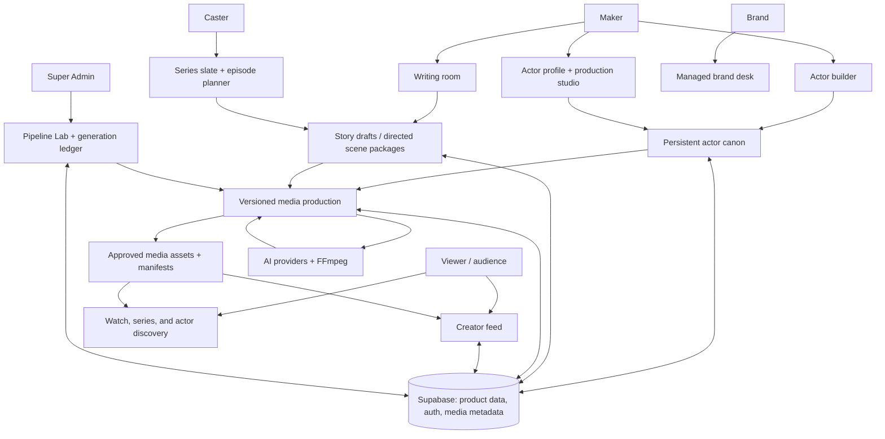
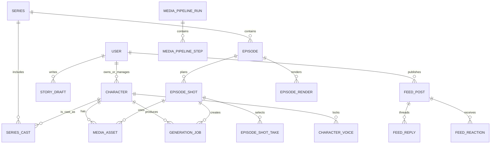
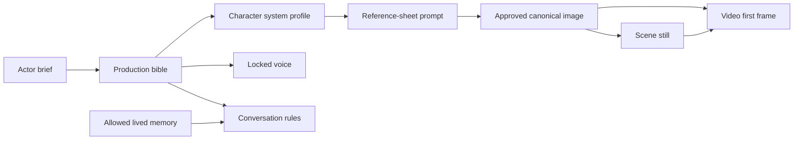
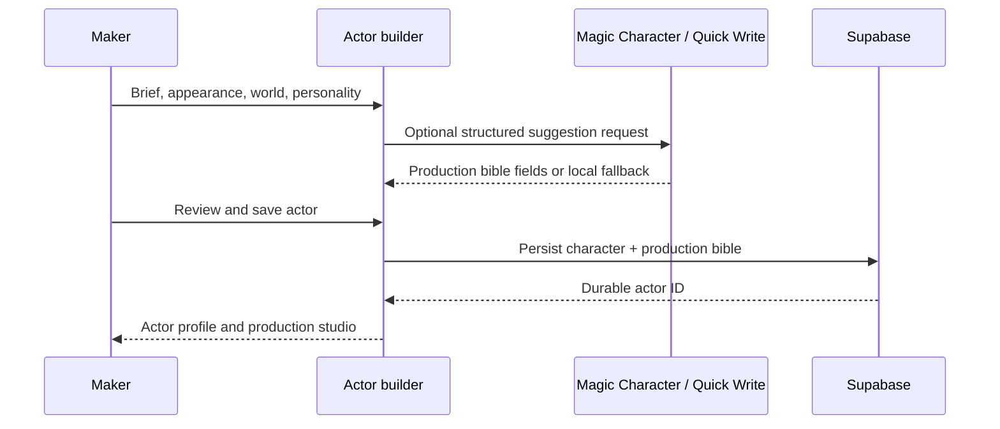
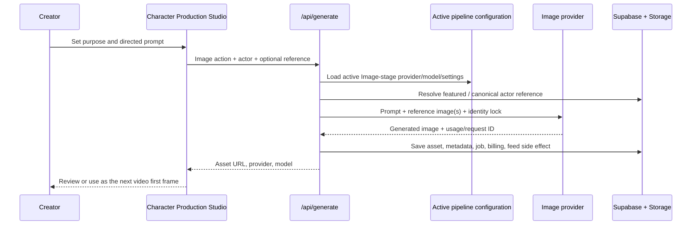
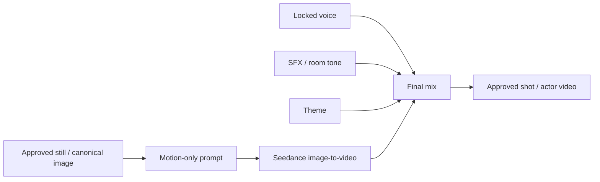
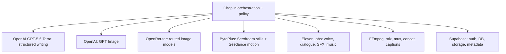
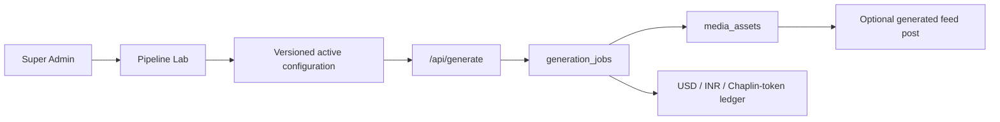
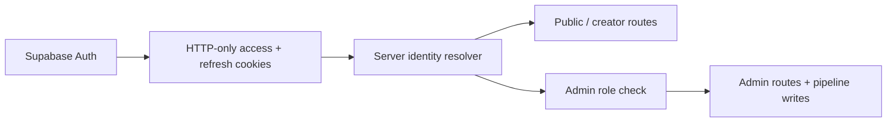

# Chaplin — Product Wiring Map

> **Purpose:** a product-management map of what Chaplin is, how its user-facing
> surfaces connect, what each system owns, and where the product is implemented
> versus planned. This is the single orientation document for product, design,
> operations, and engineering.

## 1. Product in one sentence

**Chaplin is a managed AI-actor production platform:** makers create durable
actor identities, casters use those actors in serialized stories, brands buy
managed performances, and the public discovers approved work through a
creator feed.

The durable asset is the **actor**, not a one-off generated clip. Every story,
still, performance, voice line, and motion plate should resolve back to that
actor's approved identity.

## 2. Product model

| Audience | Primary need | Primary surface | Successful outcome |
| --- | --- | --- | --- |
| Maker / creator | Build a reusable AI actor and prove it can perform | Actor builder, actor profile, production studio | A consistent, castable actor with approved media |
| Caster | Build an audience promise and reliably produce an episode chain | Series slate, series detail, episode planner | A 12-shot, cliffhanger-led episode plan and approved render |
| Brand | Commission a face or campaign without operating AI tooling | Brand desk / managed-production intake | An approved pilot or campaign delivery |
| Viewer | Follow characters and stories in public | Creator feed, actor pages, watch / series pages | Discover, react to, and continue a story |
| Super Admin | Control providers, spend, jobs, catalog, and quality | Admin dashboard, Pipeline Lab, generation logs | Safe, observable production operations |

### Product boundaries

- Chaplin is **not** a generic text-to-video playground.
- Brands approve briefs and deliveries; Chaplin operates generation.
- The feed contains approved Punches, Episodes, and Spots—not raw previews or
  private Sparks.
- A motion model animates an approved still; it does not invent an actor from a
  biography prompt.

## 3. Whole-product map

## 4. Experience architecture

### Public and creator-facing web routes

| Area | Route(s) | Product job | Current status |
| --- | --- | --- | --- |
| Home | `/` | Entry point into the creator ecosystem | Implemented |
| Feed | `/feed`, `/feed/[id]` | Public conversation around approved work | Implemented |
| Actors | `/characters`, `/characters/[id]` | Discover an actor; inspect personality, gallery, sound, and production work | Implemented |
| Actor system | `/characters/[id]/system` | Inspect actor canon, sheets, memory boundaries, media, and production links | Implemented; pannable canvas on desktop |
| New actor | `/characters/new` | Establish a new actor and its production bible | Implemented |
| Create | `/create` | Creation entry point | Implemented |
| Studio | `/studio`, `/studio/write`, `/studio/pipelines` | Creator work, story development, and pipeline status | Implemented |
| Stories | `/stories`, `/stories/[id]` | Story inventory and detail | Implemented |
| Series | `/series`, `/series/new`, `/series/[id]` | Series promise, cast, pilot, and episode planning | Implemented |
| Productions | `/productions/[id]` | Review a production run | Implemented |
| Brand | `/brand` | Brand-facing managed-production path | Implemented as product surface |
| Ledger | `/ledger` | Cost / earnings visibility | Implemented as product surface |

### Admin routes

| Area | Route | Product job |
| --- | --- | --- |
| Admin landing | `/admin` | Operational overview |
| Pipeline Lab | `/admin/pipeline` | Version and activate creative-stage provider/model settings |
| Generation logs | `/admin/logs` | Review jobs, usage, cost, outputs, and failures |
| Admin login | `/super-admin` | Private, direct-only Super Admin access gate |

### Mobile boundary

The repository includes an Expo mobile client and `/api/v1/mobile/*` contracts
for sessions, characters, drafts, library, reference, Spark prompts, and
generation. **The current delivery priority is the web product; mobile is a
future client, not the active editing target.**

## 5. Core domain model and ownership

| Object | Product owner / meaning | System of record |
| --- | --- | --- |
| User / profile | Account, role, maker identity | Supabase Auth + `user_profiles` / `users` |
| Character | The durable actor and its public profile | `characters` |
| Production bible | Dramatic, visual, performance, camera, lighting, and continuity canon | `characters.production_bible` JSONB |
| Character system | Sheet views, age states, interaction rules, and memory policy | Inside production bible JSONB |
| Character voice | The single approved ElevenLabs voice identifier | `character_voices` |
| Media asset | A reusable image, audio, video, poster, or delivery artifact | Supabase Storage + `media_assets` metadata |
| Generation job | Auditable individual provider run | `generation_jobs` |
| Pipeline configuration | Active provider/model/prompt settings by creative stage | `pipeline_settings` + version history |
| Story draft | Private creative draft and production format | `story_drafts` |
| Series / episode / shot | Serialized story plan and ordered shot chain | `series`, `episodes`, `episode_shots` |
| Production run / step | Reviewable orchestration state for an output | `media_pipeline_runs`, `media_pipeline_steps` |
| Feed post | Public conversation item, optionally tied to a source asset | `feed_posts`, replies, reactions |

## 6. Actor identity: the central wiring contract

Chaplin keeps three different kinds of actor data separate:

| Layer | May change? | What it contains | Who changes it |
| --- | --- | --- | --- |
| Immutable canon | No, except explicit creator revision | Name, recognition locks, core contradiction, moral boundary, locked identity | Creator / approved system action |
| Approved state | Yes, by deliberate selection | Featured cover, sheet views, age state, active voice, selected theme/SFX/video | Creator / reviewer |
| Lived memory | Yes, within policy | Events, relationships, promises, injuries, possessions | Interaction / story systems under memory rules |

**Rule:** a scene may change performance, camera, set, blocking, or light. It
must not silently recast the actor.

## 7. Creation and production flows

### 7.1 Create an actor

The actor builder can use OpenAI GPT-5.6 Terra suggestions when configured; it
falls back to local, archetype-aware suggestions so an unset writing key never
blocks creation.

### 7.2 Generate an actor still or scene still

The image stage currently supports:

| Provider | Role in Chaplin | Active model configuration |
| --- | --- | --- |
| BytePlus ModelArk | Seedream still generation | Seedream model choices, including Seedream 5 |
| OpenRouter | Routed image models, including Nano Banana choices | Selected in Pipeline Lab |
| OpenAI | GPT Image generation and reference-image editing | GPT Image 2 is active as of pipeline revision 2 |

Every image request adds the canonical-reference identity lock and records the
actual reference source and asset ID in media metadata.

### 7.3 Generate a five-second performance

- Seedance receives the selected still as the exact first frame.
- The video prompt controls timed movement, camera path, secondary motion, and
  final frame; it does not repeat biography or audio direction.
- Dialogue, SFX, and music are generated separately and are intended to be
  mixed after motion generation.
- A canonical image can now act as the video reference even before a new scene
  still is generated, so a complete actor is not blocked at the video step.

### 7.4 Build a series and episode

```mermaid
flowchart LR
  Promise["Audience promise + recurring conflict"] --> Cast["Cast lock"]
  Cast --> Episode["Ordered 12-shot episode plan"]
  Episode --> Shot["Each 5-second shot package"]
  Shot --> Review["Reference, motion, audio, QC, approval"]
  Review --> Assemble["FFmpeg episode assembly"]
  Assemble --> Publish["Approved episode + feed post"]
  Publish --> Next["Continuity-out feeds next episode"]
```

The target production rule is one 60-second episode made from exactly twelve
five-second shot units, where every shot changes information, pressure, or
choice, and the final shot creates a situation-changing cliffhanger.

## 8. Prompting and AI-provider model

### Prompt ownership

| Provider / stage | What Chaplin sends | What it deliberately excludes |
| --- | --- | --- |
| OpenAI GPT-5.6 Terra | Brief, actor canon, story or quick-write task | Provider-specific image/video instructions |
| Image provider | Prompt prelude + directed visual beat + canonical reference + identity lock | Generic actor recreation or unapproved restyling |
| Seedance video | Approved still + motion/camera/timing/failure locks | Biography, audio instructions, identity redesign |
| ElevenLabs Voice Design | Voice persona, language, age, timbre, pacing, pressure delivery | Visual direction |
| ElevenLabs dialogue | Locked voice ID, dialogue, stable seed, voice settings | New voice identity |
| ElevenLabs SFX / music | Physical event or musical direction | Actor biography or visual prompt |
| FFmpeg | Approved video/audio assets and delivery settings | Creative interpretation |

### Provider responsibilities

The pipeline—not a provider callback—owns sequencing, review, approval,
publishing, and the durable manifest.

## 9. Pipeline control, review, and billing

### Pipeline configuration

Super Admin controls the active configuration in **Pipeline Lab**. A
configuration has independently enabled stages for writing, voice, SFX, theme,
image, and video. Each stage has a provider, model, prompt prelude, and
provider-specific settings.

### State model

| Run state | Meaning |
| --- | --- |
| `draft` → `queued` → `running` | Work is specified and executing |
| `needs_review` → `approved` | A human / QC gate selects the result |
| `assembling` → `succeeded` | Approved pieces become a final output |
| `failed` / `cancelled` | Terminal exception states; retries create new attempts |

Steps additionally use `blocked`, `ready`, `queued`, `running`,
`needs_review`, `approved`/`succeeded`, `failed`, `skipped`, or `cancelled`.
Downstream results become stale after a rejected upstream output; they are not
deleted.

### Cost and observability

- Each paid run begins as a `generation_jobs` record before the provider call.
- The result records provider, model, request ID, returned usage, output asset,
  provider credits when available, USD estimate, INR conversion, and normalized
  Chaplin-token equivalent.
- Generation outputs are saved in Supabase Storage and described by a durable
  `media_assets` row.
- Provider failures are saved against the job; provider health is exposed on
  actor production surfaces and Admin logs.
- OpenAI currently reports usage; Chaplin estimates a dollar amount from the
  configured image rate when the provider does not return billed USD.

## 10. API map

| API family | Primary product responsibility |
| --- | --- |
| `/api/auth` | Session lifecycle, profile/role setup, admin bootstrap |
| `/api/characters`, `/api/characters/profile-media` | Actor CRUD and featured-media selection |
| `/api/generate` | Voice, dialogue, SFX, music, image, and video generation; status/readiness |
| `/api/write/*` | Magic story, directed scene package, quick field rewrite, and character suggestions |
| `/api/pipeline/*` | Create/read pipeline runs, transition steps, mix, and assemble |
| `/api/series/*` | Series, cast, episodes, and shot planning |
| `/api/feed`, `/api/feed/replies`, `/api/feed/reactions` | Feed posts and social conversation |
| `/api/drafts` | Private creator drafts |
| `/api/admin/*` | Admin bootstrap, uploads, and active pipeline configuration |
| `/api/agent/*` | Concierge intent, speech, voice-session, and telemetry contracts |
| `/api/v1/mobile/*` | Mobile client compatibility boundary |

## 11. Authentication and permissions

- Roles include maker, caster, brand, and admin; the public product currently
  presents a unified creator experience for non-admin roles.
- The Super Admin area is explicitly protected by a server-side admin-role
  check.
- Supabase row-level security is enabled across product tables; privileged
  server operations use the service-role client behind API routes.
- Provider credentials live in `.env.local` locally and server deployment
  environment variables in production. They must never reach browser code.

## 12. What is implemented versus next

| Capability | Current state | Product implication |
| --- | --- | --- |
| Actor catalog, profile, bible, sheets, assets | Implemented | The actor is a durable product primitive |
| Creator feed, replies, reactions, repost context | Implemented | Public discovery can be conversation-led |
| Actor still, voice, SFX, theme, and five-second video generation | Implemented | A creator can test actor performance end-to-end |
| OpenAI GPT Image integration | Implemented and active | OpenAI can produce reference-guided actor scene stills |
| Versioned Pipeline Lab and generation ledger | Implemented | Operations can switch providers and inspect spend |
| Series / episode / shot planning | Implemented | Narrative planning exists before final render automation |
| Formal production-run orchestration tables / UI | Implemented | Reviewable state model is represented durably |
| Automated 12-shot render assembly, retry, replacement, approval workflow | Partially implemented / next | Needed for reliable episode delivery |
| Full QC: identity, lip sync, loudness, rights, captions, manifests | Planned / partial primitives | Needed before a publish-scale production promise |
| Audience signals: follows, completion, replay, next-episode events | Planned | Needed to prove actor and series demand |
| Rights windows, contracts, invoicing, royalty settlement | Planned | Needed for the brand and marketplace business model |
| Mobile app delivery | Deferred | Preserve API contract; do not split current web focus |

## 13. Product operating principles

1. **Identity before output.** Never trade actor recognition for a prettier
   individual frame.
2. **Approved inputs before motion.** The still is the source of truth for the
   video plate.
3. **Separate creative layers.** Writing, visual direction, motion, dialogue,
   SFX, music, and final mix have different prompts and different quality gates.
4. **Version everything that changes production behavior.** Provider settings,
   assets, jobs, prompts, selection decisions, and delivery manifests are
   evidence—not invisible state.
5. **Keep operators in control.** Providers execute; Chaplin decides the next
   step, whether to approve, and whether to publish.
6. **Optimize for an audience relationship.** A Punch or Episode should prove a
   character and advance a story, not merely demonstrate generation quality.

## 14. Recommended product scorecard

| Layer | Leading indicators | Guardrails |
| --- | --- | --- |
| Actor creation | Completed bibles, identity assets approved, first-generation success rate | Identity drift / manual rejection rate |
| Production | Time from brief to approved shot, retry rate, cost per approved asset | Provider failure rate, unreviewed publication |
| Story / series | Planned-to-rendered episode conversion, next-episode readiness | Continuity / cliffhanger QC failures |
| Audience | Feed completion, replay, follows, reactions, return rate | Raw-preview dominance over approved work |
| Marketplace | Actor cast rate, brand pilot conversion, maker earnings | Rights / usage exceptions |
| Operations | Cost per delivered second, provider latency, ledger completeness | Spend anomalies, failed job recovery time |

## 15. Source-of-truth code and documentation

| Topic | Primary source |
| --- | --- |
| Product direction | `docs/PRODUCT_DIRECTION.md` |
| Actor canon and prompt wiring | `docs/CHARACTER_SYSTEM.md`, `src/lib/character-system.ts`, `src/lib/production-prompting.ts` |
| Production contract | `docs/MEDIA_PIPELINES.md`, `src/lib/media-pipeline-types.ts`, `src/lib/server/media-pipeline.ts` |
| Generation routing | `src/app/api/generate/route.ts` |
| Active provider/model configuration | `src/lib/pipeline-config.ts`, `src/lib/server/pipeline-config.ts`, `src/components/AdminPipelineLab.tsx` |
| Product persistence and media saving | `src/lib/server/supabase-admin.ts`, `supabase/migrations/` |
| Authentication | `src/lib/server/auth.ts`, `src/app/api/auth/route.ts` |
| Series | `src/lib/server/series.ts`, `src/components/EpisodePipelineBoard.tsx` |
| Feed | `src/lib/server/feed.ts`, `src/components/CreatorFeed.tsx` |

---

### PM handoff summary

Chaplin already has the foundations for a controlled AI-actor production
business: stable actor canon, provider-agnostic generation, versioned pipeline
configuration, asset/job lineage, a social discovery layer, and a series-shot
domain model. The next product milestone is not another model integration; it
is completing the **approved shot → assembled episode → audience signal** loop
with reliable QC, approvals, and delivery manifests.
